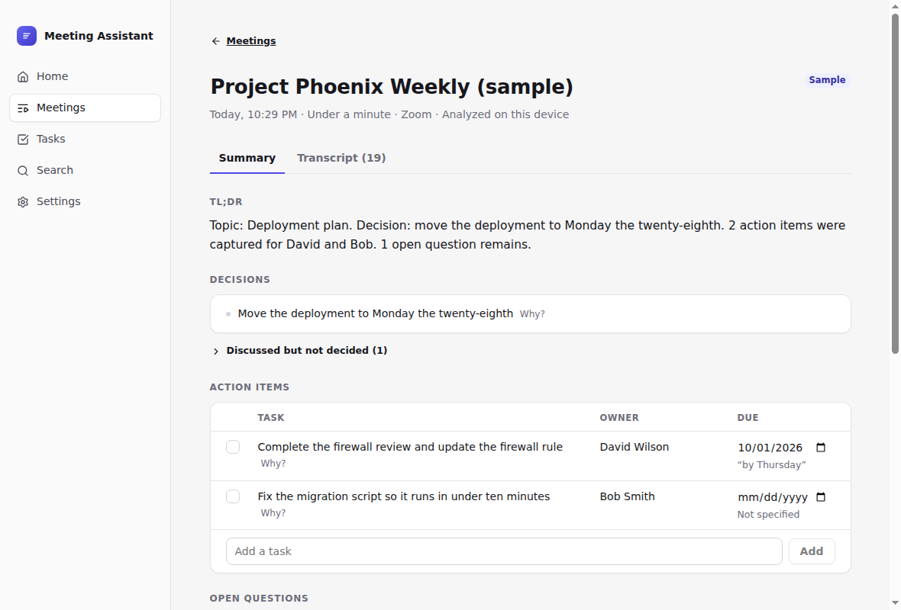
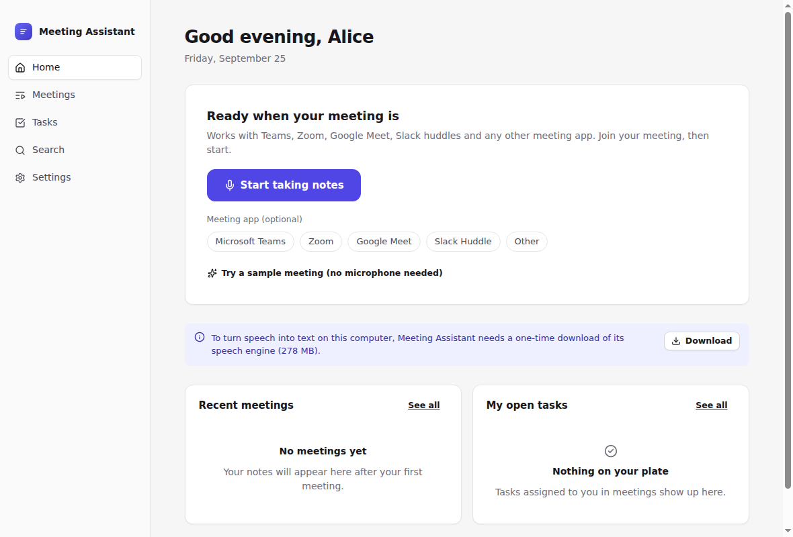
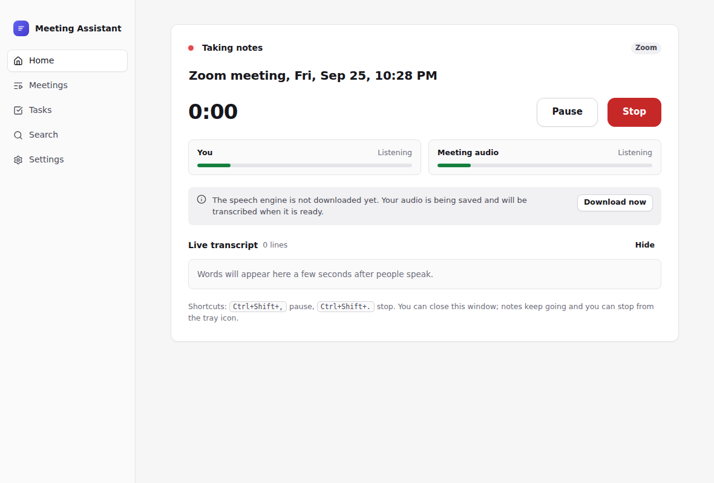
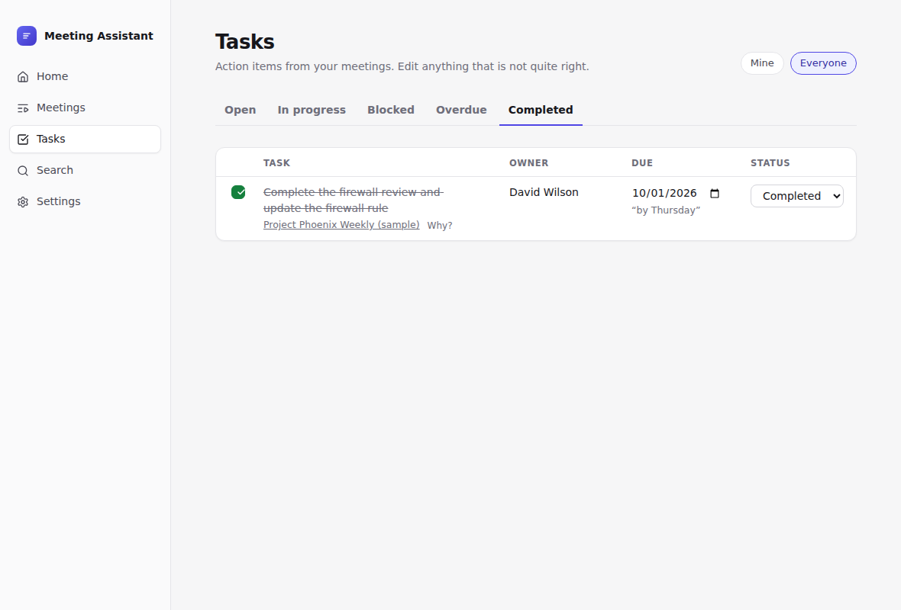
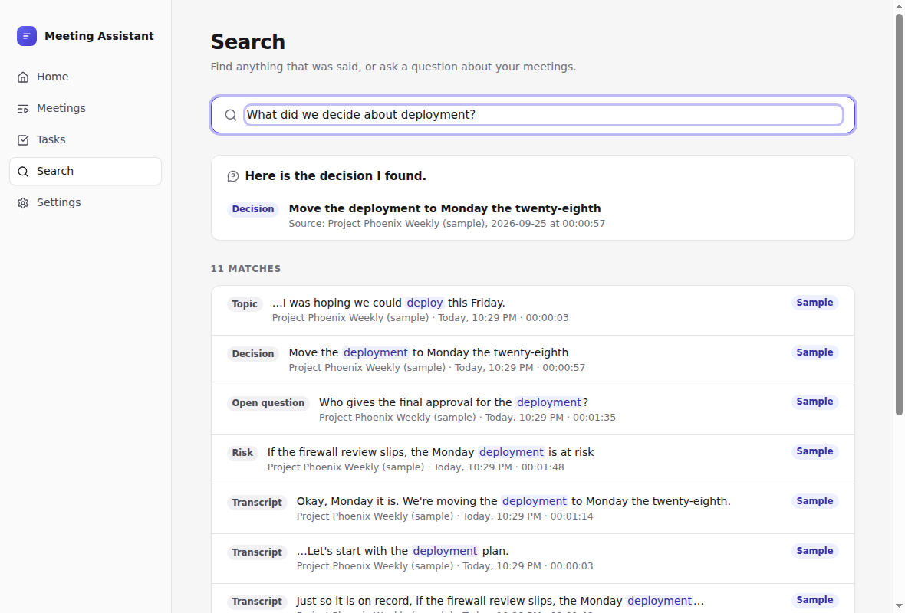

# Meeting Assistant

A desktop app that turns any meeting into notes you can act on. Open it, press **Start taking notes**, press **Stop**, and a moment later you have a short summary, the decisions, action items with owners and due dates, open questions, risks, and a follow-up email ready to review.

It works the same with Microsoft Teams, Zoom, Google Meet, Slack huddles or anything else, because it listens on your computer instead of joining the call. Speech is turned into text on your computer. Nothing leaves it unless you choose Cloud AI.



## Current status

**Working beta, not yet released.** The full flow works end to end and is tested on Linux, Windows and macOS in CI, including real speech recognition on synthetic meeting audio and the packaged app. It has **not** been used on real Teams, Zoom, Meet or Slack calls on real Windows or Mac laptops yet, and installers are unsigned. See [docs/status.md](docs/status.md) for the honest details.

## Features

- **Capture any meeting**: your microphone and the meeting's audio, captured separately. Pause, resume, stop from the app, the tray or keyboard shortcuts. The app notices when a meeting starts and offers to take notes, but never starts on its own.
- **Live transcript on your computer** with speaker labels ("You", "Speaker 2", ...). Rename a speaker once and the notes follow. Names are never invented.
- **Notes you can trust**: every decision and task links to the words it came from ("Why?"). Decisions are marked confirmed only when someone agreed. Dates like "by Thursday" become real dates, and anything unclear is marked "Needs review" instead of guessed.
- **Follow-up email**: reviewed by you, opened in your own mail app. It warns about recipients outside your company and never sends anything by itself.
- **My Tasks** across all meetings: open, in progress, blocked, overdue, completed.
- **Search and ask** across meetings ("What do I owe?", "What did we decide about the vendor?"), with links to the source.
- **Recurring meetings**: what changed since last time.
- **Privacy**: local by default, raw audio deleted after processing, delete a meeting or everything at any time, optional automatic deletion.
- **Sample meetings** (Acme Demo Corporation) to try everything without a real meeting.

| Home                                  | Live                                          | Tasks                                   | Ask                                 |
| ------------------------------------- | --------------------------------------------- | --------------------------------------- | ----------------------------------- |
|  |  |  |  |

## Supported platforms

| Platform                              | Status                                                                                                     |
| ------------------------------------- | ---------------------------------------------------------------------------------------------------------- |
| Windows 10/11 x64                     | First class. Meeting audio through Windows loopback, no driver needed.                                     |
| macOS 14.2+ (Apple silicon and Intel) | First class. Meeting audio through Core Audio taps (needs the Screen & System Audio Recording permission). |
| macOS 12 to 14.1                      | Microphone only; the app says so.                                                                          |
| Linux x64                             | Best effort (PulseAudio or PipeWire).                                                                      |

Details and what has and has not been tested: [docs/platform-support.md](docs/platform-support.md).

## Architecture overview

```
apps/desktop      Electron app: capture, speech engine, storage, UI, email, tray
packages/core     Meeting intelligence in plain TypeScript: transcript cleanup,
                  extraction (offline rules or Claude), validation, email, search, Q&A
```

1. A hidden window captures the microphone and meeting audio (macOS: AudioTee) as 16 kHz audio.
2. A separate process runs on-device speech recognition (sherpa-onnx: Silero VAD, Moonshine, WeSpeaker) and saves lines as they are spoken.
3. At Stop, the transcript goes through one structured extraction pass (offline rules by default, Claude optionally), then a validator that drops anything without evidence.
4. Everything is stored in SQLite with full-text search, in your user data folder.

More: [docs/architecture.md](docs/architecture.md), decisions in [docs/architecture-decisions.md](docs/architecture-decisions.md).

## Prerequisites

- To use: Windows 10/11, macOS 12+ (14.2+ for meeting audio) or Linux x64. About 300 MB of disk for the one-time speech engine download.
- To build: Node.js 22.12+, pnpm 10 (`corepack enable`). On Linux, Electron's usual system libraries.

## Getting started (from source)

```bash
pnpm install
pnpm dev                 # run the app
```

In the app, choose **Explore with sample meetings** to look around, or **Try a sample meeting** on Home to watch notes being taken without a microphone. For real meetings, download the speech engine when asked (one time).

Optional Cloud AI: add your own Claude API key under Settings. The transcript is then sent to Anthropic for that meeting's notes; the offline engine is used if Claude is unavailable.

## Testing

```bash
pnpm lint && pnpm format:check && pnpm typecheck
pnpm test          # 167 core + 87 desktop unit tests
pnpm eval          # AI quality gate on 16 annotated meetings
pnpm e2e           # Playwright drives the real Electron app (Linux: xvfb-run -a pnpm e2e)
```

What each layer covers and the manual real-device checklist: [docs/test-plan.md](docs/test-plan.md). Latest numbers: [docs/test-results.md](docs/test-results.md).

## Building installers

```bash
pnpm package       # installers for the current OS in apps/desktop/release/<version>/
```

CI builds Windows, macOS and Linux installers on every push. Signing, releases and auto-update: [docs/deployment.md](docs/deployment.md).

## Documentation

|                                                                                   |                                                     |
| --------------------------------------------------------------------------------- | --------------------------------------------------- |
| [Status](docs/status.md)                                                          | What works, what does not, release readiness        |
| [Product requirements](docs/product-requirements.md)                              | What the product must do and where each item stands |
| [Project plan](docs/project-plan.md)                                              | Milestones and backlog                              |
| [Architecture](docs/architecture.md), [decisions](docs/architecture-decisions.md) | How it is built and why                             |
| [Security and privacy](docs/security.md)                                          | Data, hardening, AI safety                          |
| [Test plan](docs/test-plan.md), [results](docs/test-results.md)                   | How it is tested and the numbers                    |
| [Bug log](docs/bug-log.md), [risk register](docs/risk-register.md)                | Known bugs and risks                                |
| [Platform support](docs/platform-support.md), [deployment](docs/deployment.md)    | Where it runs and how it ships                      |
| [Open-source dependencies](docs/open-source-dependencies.md)                      | What we reuse and the licenses                      |
| [Project memory](docs/project-memory.md)                                          | Durable facts for contributors                      |

## Privacy and consent

Please let people know when you are taking notes. In some places everyone in a conversation must agree before it is recorded.
