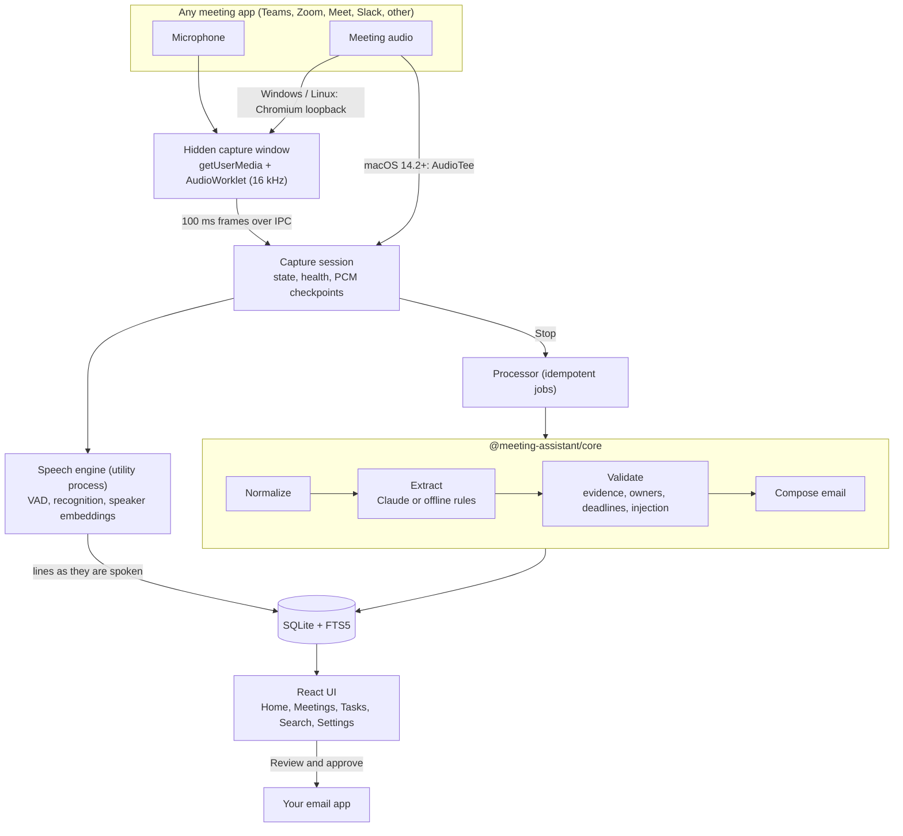

# Architecture

One capture engine and one intelligence engine for every meeting app. The platform only changes a label and detection hints.

## Processes

| Process                            | Responsibilities                                                                                                                                                     |
| ---------------------------------- | -------------------------------------------------------------------------------------------------------------------------------------------------------------------- |
| Main (Node)                        | `Services`: data access (`Repo`), settings and secrets, capture session, processing queue, model downloads, email providers, tray, menus, shortcuts, sleep handling. |
| Main window (renderer, sandboxed)  | The UI. Talks to main only through `window.bridge.invoke(channel, ...args)`; every call is validated with zod.                                                       |
| Capture window (hidden, sandboxed) | Microphone and loopback streams, AudioWorklet tap, sends Float32 frames. No UI.                                                                                      |
| Speech utility process             | sherpa-onnx VAD, recognition, speaker embeddings; end-of-meeting speaker clustering.                                                                                 |
| AudioTee (macOS)                   | Swift child process streaming system audio as PCM.                                                                                                                   |

## Data model (SQLite)

`tenants`, `users`, `meetings`, `participants`, `speakers`, `transcript_segments`, `screen_notes`, `notes`, `topics`, `decisions`, `action_items`, `open_questions`, `risks`, `email_drafts`, `jobs`, `settings`, `audit_log`, `ai_cache`, and the FTS5 table `search_index`. Every meeting row has `tenant_id` and `owner_id`; `Repo` checks the core access policy on every call.

## Meeting lifecycle

`capturing` ↔ `paused` → `processing` → `ready` (or `failed`). A crash leaves `capturing`; the next launch marks it `interrupted` and offers recovery. Transcript lines are saved as they are produced, and raw audio is appended to `audio/<meeting>/<channel>.pcm`, so a crash loses seconds, not the meeting. If the speech engine was unavailable, the saved audio is transcribed after the meeting.

## AI pipeline

1. Normalize: clean text, repair timestamps, drop duplicates, remove microphone echo of meeting audio.
2. Extract: one schema-constrained call (Claude) or the offline rules engine. Every item cites segment ids.
3. Validate: drop items without evidence or built from injected instructions; clear owners not grounded in names or speaker labels; keep a deadline only if its phrase is in the evidence, then normalize it in the meeting's time zone; demote superseded decisions; replace an ungrounded TL;DR.
4. Compose the email from validated notes (no model involved).

Long meetings are chunked (cached per part) and merged with a small synthesis call. If Claude is unavailable, the rules engine runs instead and the notes say so.

## Security boundaries

- Renderer: `contextIsolation`, `sandbox`, no Node, strict CSP, no navigation, no new windows, permission requests only for media from our windows.
- IPC: one invoke channel, sender must be the main window, zod-validated arguments, errors reduced to safe messages.
- Data: user-private file permissions, secrets through the OS keychain (`safeStorage`), logs never contain transcript text or secrets.
- Model output is data: nothing the model says can send email, delete data or change settings.

See [security.md](security.md) and [architecture-decisions.md](architecture-decisions.md).
